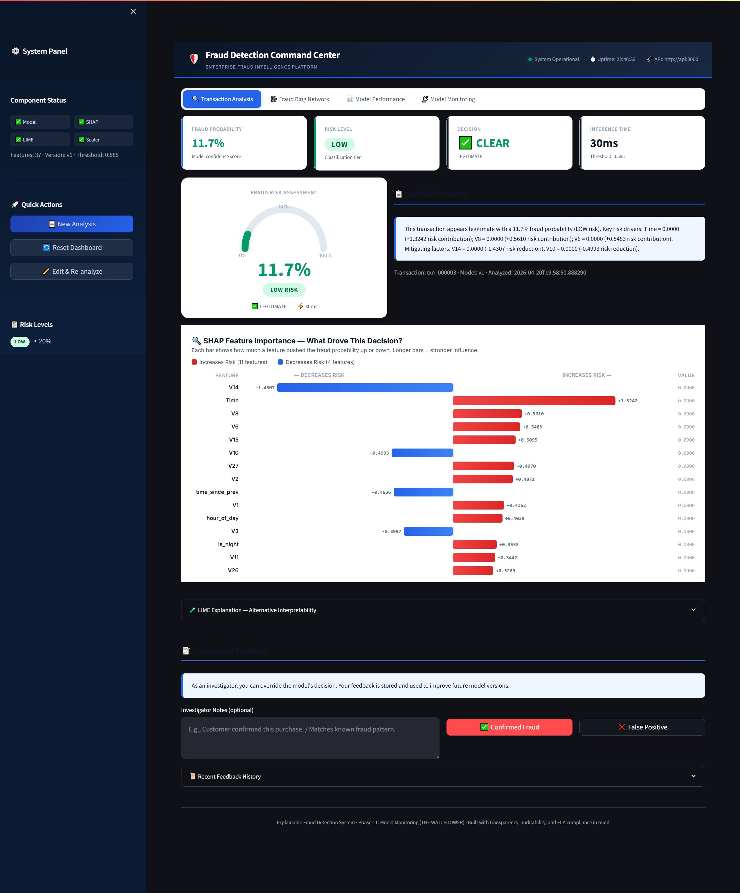
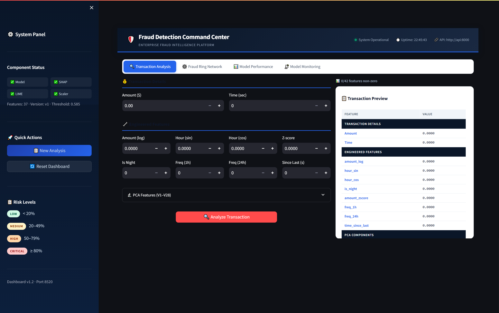
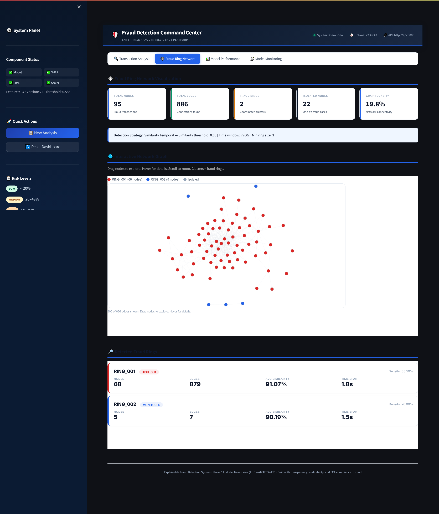
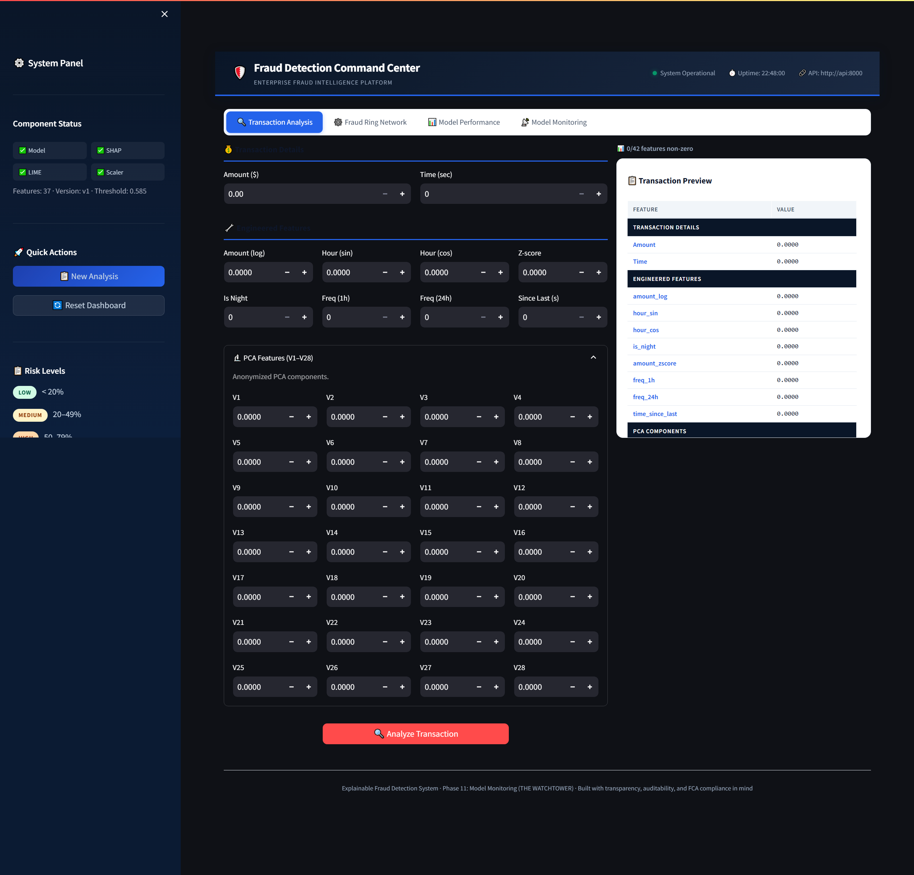

# Explainable Fraud Detection System

[](https://www.python.org/)
[](https://xgboost.readthedocs.io/)
[](https://fastapi.tiangolo.com/)
[](https://streamlit.io/)
[](https://shap.readthedocs.io/)
[](https://www.docker.com/)
[](https://www.hetzner.com/)
[]()
[](LICENSE)

> An end-to-end fraud detection pipeline built for UK banking compliance. Every prediction comes with a plain-English explanation, a human override button, and a paper trail that satisfies FCA Consumer Duty and Article 22 GDPR.

## Live Demo

- **API (health check):** http://46.225.208.197:8002/health
- **Interactive Dashboard:** http://46.225.208.197:8520

Both services run in hardened Docker containers on a Hetzner CPX32 VPS behind a 9-rule firewall.

## What It Does

- Scores each transaction in **~20 ms** using an XGBoost model trained on 284,807 real credit card transactions
- Explains **every** prediction with SHAP (global importance) and LIME (local reasoning) — no black-box outputs
- Detects **fraud rings** by building a NetworkX graph of shared account, device, and merchant edges
- Lets investigators **override model decisions** with one click and writes every correction to SQLite
- Monitors **prediction drift** in real time and flags when the live feature distribution diverges from training
- Exposes **15 REST endpoints** for prediction, feedback, history, stats, monitoring, and explainability
- Runs the **same containers** locally and in production via `docker-compose`

## Dashboard


*Transaction Analysis — single-transaction scoring with SHAP waterfall and LIME breakdown*


*Fraud Ring Network — NetworkX graph of shared attributes between suspicious accounts*


*Model Performance — XGBoost vs LightGBM head-to-head with AUPRC as the primary metric*


*Model Monitoring — live drift detection against the 56,746-sample training baseline*

## Why I Built It

UK banks lose hundreds of millions a year to card fraud, and the tools meant to stop it have a second problem nobody talks about — they are unauditable. A rule-based system flags a transaction, a junior analyst rubber-stamps it, and if a customer complains the bank cannot explain *why* the decision was made.

The FCA Consumer Duty (July 2023) and Article 22 of the UK GDPR both make this untenable. Customers have a legal right to an explanation. Banks have a regulatory duty to show "foreseeable harm" was considered. A black-box XGBoost model does not meet that bar.

This project was built to meet it. Every prediction carries a SHAP and LIME explanation in plain English, every investigator decision is logged, and every correction becomes training data for the next model version. The stack is the same stack real banks use — Python, FastAPI, Docker — so the learning transfers directly.

## Tech Stack

| Layer | Technology | Why this choice |
|-------|------------|-----------------|
| Modelling | XGBoost 2.0.3, LightGBM 4.3.0 | Gradient-boosted trees give millisecond inference and rank at the top of fraud-detection benchmarks. Both trained; XGBoost won on AUPRC |
| Explainability | SHAP 0.45, LIME | SHAP for global feature importance (Shapley values are game-theoretically fair); LIME for local "why this row" explanations |
| Graph Analytics | NetworkX 3.2 | Builds undirected graphs of shared accounts, devices, merchants — reveals fraud rings that individual transaction scoring cannot |
| API | FastAPI 0.109 | Async, auto-generated OpenAPI docs, Pydantic validation — the production standard for Python ML serving |
| Dashboard | Streamlit 1.31 | Pure Python UI, no frontend build step — investigators get the same tool whether they run it locally or via the live URL |
| Storage | SQLite (feedback + drift), Parquet (features) | SQLite is zero-infra and appropriate for low-write-volume investigator corrections. Parquet is columnar and compresses 5x over CSV |
| Orchestration | Docker 29.1 + docker-compose 1.29 | Same container runs on my laptop and on the production server. No "works on my machine" |
| Deployment | Hetzner CPX32 (8 GB RAM / 4 vCPU) | €16.79/month, full root access, hardware firewall included. Hardened with tmpfs noexec, 2-CPU limits, and a 9-rule inbound firewall |
| CI/CD | GitHub Actions | Every push runs the full 204-test suite on Ubuntu 22.04 before merging |
| Logging | Python `logging` + `phase_status.json` | Every phase writes to one pipeline log. If something breaks overnight, the log says which phase and which line |

## Architecture

```
                    ┌──────────────────────────────────────┐
                    │       CONFIG LAYER  (config.yaml)     │
                    │       Single source of truth          │
                    └──────────────────────────────────────┘
                                      │
    ┌─────────────────────────────────┼─────────────────────────────────┐
    ▼                                 ▼                                 ▼
┌──────────────────┐        ┌──────────────────┐            ┌──────────────────┐
│   DATA LAYER     │        │   MODEL LAYER    │            │ DEPLOYMENT LAYER │
│                  │        │                  │            │                  │
│ Raw Vault        │        │ XGBoost train    │            │ FastAPI (port    │
│   (Kaggle CC)    │        │ LightGBM train   │            │   8002)          │
│     ↓            │        │     ↓            │            │     ↓            │
│ Ingestion +      │        │ AUPRC compare    │            │ SHAP / LIME      │
│ GDPR log         │        │     ↓            │            │ on demand        │
│     ↓            │        │ Stress tests     │            │     ↓            │
│ Feature eng.     │        │ (11 attacks)     │            │ Streamlit        │
│ (37 features)    │        │     ↓            │            │   (port 8520)    │
│     ↓            │        │ SHAP / LIME      │            │     ↓            │
│ Train/val/test   │        │ explainers       │            │ Feedback DB      │
│ split            │        │                  │            │ (SQLite)         │
│     ↓            │        │                  │            │     ↓            │
│ NetworkX graph   │        │                  │            │ Drift monitor    │
│ (fraud rings)    │        │                  │            │ (baseline JSON)  │
└──────────────────┘        └──────────────────┘            └──────────────────┘
                                      │
                                      ▼
                    ┌──────────────────────────────────────┐
                    │   CI/CD  (GitHub Actions)            │
                    │   204 tests on every push            │
                    └──────────────────────────────────────┘
```

Each phase reads the artifacts of the previous phase and writes its own. If the dashboard crashes, the model keeps scoring. If training fails, the raw data vault is untouched and does not need to be regenerated. Phase isolation is the whole point.

## Project Phases

| # | Phase | Deliverable | Tests |
|---|-------|-------------|-------|
| 0 | Environment & Config | `config.yaml`, `logger.py`, folder skeleton | 12 |
| 1 | Business Logic & Compliance | `README.md`, `compliance_notes.md`, architecture diagram | 14 |
| 2 | Data Ingestion (The Vault) | `data_ingestion.py`, `data_manifest.json`, `gdpr_privacy_log.json` | 11 |
| 3 | Data Engineering & Feature Store | 37 engineered features, train/val/test split, class weights | 18 |
| 4 | Graph Analytics (The Detective) | `fraud_graph.gpickle`, `fraud_rings.json` via NetworkX | 15 |
| 5 | Model Training (The Judge) | `xgboost_fraud_v1.pkl`, `lightgbm_fraud_v1.pkl`, `best_model.pkl` | 16 |
| 6 | Adversarial Stress Testing | 11 perturbation attacks, `stress_test_results.json` | 17 |
| 7 | Explainability (The Translator) | `shap_explainer.pkl`, `lime_explainer.pkl`, `xai_report.txt` | 14 |
| 8 | FastAPI Inference Server | 15 REST endpoints, Pydantic validation | 23 |
| 9 | Streamlit Dashboard (The Front Desk) | 4-tab UI, SHAP waterfalls, graph visualiser | 24 |
| 10 | Human-in-the-Loop & CI/CD (The Sentinel) | SQLite feedback DB, GitHub Actions workflow | 22 |
| 11 | Model Monitoring (The Watchtower) | drift detector, 56,746-sample baseline, dashboard tab | 22 |

**Total: 12 phases, 204 tests, all passing on main.**

## How To Run Locally

Clone and set up:

```bash
git clone https://github.com/NakuSurrey/explainable-fraud-detection-system.git
cd explainable-fraud-detection-system
python -m venv venv
source venv/bin/activate    # Windows: venv\Scripts\activate
pip install -r requirements.txt
```

Get the dataset (one file, ~150 MB):

```bash
# Download from Kaggle: https://www.kaggle.com/datasets/mlg-ulb/creditcardfraud
# Place creditcard.csv in data/raw/
```

Run the full pipeline (takes ~10 minutes end-to-end on a laptop):

```bash
python src/preprocessing/data_ingestion.py
python src/preprocessing/data_engineering.py
python src/graph_analytics/graph_builder.py
python src/models/model_training.py
python src/testing/stress_test.py
python src/explainability/xai_engine.py
```

Start the API and Dashboard:

```bash
# Terminal 1 — API on port 8000
uvicorn src.api.inference_api:app --reload --port 8000

# Terminal 2 — Dashboard on port 8520
streamlit run src/dashboard/app.py --server.port 8520
```

Or run both in Docker:

```bash
docker-compose up -d
# API → http://localhost:8002
# Dashboard → http://localhost:8520
```

Run the full test suite:

```bash
python -m pytest tests/ -v
# Expected: 204 passed
```

## Key Decisions

- **Chose XGBoost over deep learning** — tabular data with 30 features is exactly where gradient-boosted trees beat neural nets. Training is faster, inference is sub-millisecond, and SHAP works cleanly on tree models
- **Chose class weights over SMOTE** — SMOTE generates synthetic fraud rows that can leak patterns the model overfits to. Class weights during training achieve the same rebalancing without fabricating data
- **Chose AUPRC over accuracy** — the dataset is 0.17% fraud. A model that predicts "not fraud" for everything scores 99.83% accuracy and catches zero criminals. AUPRC (area under precision-recall curve) is the correct metric for this imbalance
- **Chose two Dockerfiles over one** — `Dockerfile.api` and `Dockerfile.dashboard` are built separately so the API image does not ship Streamlit (saves ~200 MB) and the Dashboard image does not ship XGBoost (saves another ~300 MB)
- **Chose Hetzner over HuggingFace Spaces** — HuggingFace gave one-click deployment but the free tier sleeps after 48 hours and health-checks on port 7860, which fought the existing setup. Hetzner costs €16.79/month, stays up 24/7, and gives full root access for hardening
- **Chose passive retrain signal over auto-retraining** — FCA SR 11-7 requires model changes to be documented and approved by a human. The system tells the analyst "you have 100+ corrections — time to retrain" and stops there
- **Chose SQLite over Postgres for feedback** — corrections are written ~10 times a day by investigators. A full database server is wasted infrastructure at that volume

## What I Learned

- A black-box model is a compliance liability, not just an engineering quirk. SHAP and LIME are not nice-to-haves — they are the product
- AUPRC is the metric that matters for imbalanced data. Every interview question about fraud or anomaly detection should start with "why not accuracy?"
- Class imbalance has three fixes — resampling, class weights, threshold tuning — and only the last two give you a clean audit trail
- Feature engineering beats model choice on tabular problems. 37 hand-crafted features moved AUPRC more than switching from LightGBM to XGBoost
- Deployment hardening is a job. A 9-rule firewall, tmpfs `noexec`, CPU limits, and Docker resource caps are what separate a tutorial from production
- Phase isolation is the single best architectural decision in the project. Rebuilding the dashboard does not require retraining the model. The Docker split mirrors the phase split
- Docker-compose on the server turned "it works on my laptop" into "it is the same container". That is what deployment is supposed to feel like

## Dataset

Credit Card Fraud Detection dataset from Kaggle (Machine Learning Group, Université Libre de Bruxelles). 284,807 transactions over two days in September 2013. 492 fraud cases (0.17% class imbalance). Features are PCA-anonymised for GDPR compliance — the original values are never released.

Licence: Open Database License (ODbL). Downloaded to `data/raw/` at project setup and never committed to the repo.

## Repository Structure

```
explainable-fraud-detection-system/
├── config.yaml                        single source of truth
├── docker-compose.yml                 two-service local + production
├── Dockerfile.api                     FastAPI container
├── Dockerfile.dashboard               Streamlit container
├── requirements.txt                   API + shared deps
├── requirements-dashboard.txt         Streamlit-only deps
├── README.md                          this file
├── .github/workflows/                 GitHub Actions CI
├── data/
│   ├── raw/                           creditcard.csv (gitignored)
│   ├── processed/                     train/val/test splits (gitignored)
│   └── feedback/                      SQLite feedback DB (gitignored)
├── docs/
│   ├── architecture_diagram.mermaid
│   ├── compliance_notes.md
│   └── screenshots/                   dashboard tab captures
├── models/                            pickled models + explainers (gitignored)
├── graphs/                            NetworkX fraud-ring output (gitignored)
├── reports/                           stress test + XAI reports (gitignored)
├── logs/                              pipeline.log + phase_status.json (gitignored)
├── src/
│   ├── utils/logger.py                config loader + centralised logging
│   ├── preprocessing/                 ingestion + feature engineering
│   ├── graph_analytics/               NetworkX fraud-ring builder
│   ├── models/                        XGBoost + LightGBM trainers
│   ├── testing/                       adversarial stress tests
│   ├── explainability/                SHAP + LIME engine
│   ├── api/inference_api.py           15-endpoint FastAPI server (1,196 lines)
│   ├── dashboard/app.py               4-tab Streamlit UI
│   ├── feedback/                      SQLite feedback manager
│   └── monitoring/                    drift detection + baseline compare
└── tests/                             204 tests across 12 phases
```

## Compliance

- **FCA Consumer Duty (PS22/9):** every flagged transaction produces a plain-English SHAP/LIME report that meets the "foreseeable harm" explanation standard
- **UK GDPR Article 22:** no fully automated decision is final — every block routes to a human investigator with a one-click override
- **SR 11-7 (Model Risk Management):** the retrain signal is passive; model version changes require human approval and are logged
- Full compliance notes in [`docs/compliance_notes.md`](docs/compliance_notes.md)

## License

MIT — see [`LICENSE`](LICENSE).

## Author

**Nakul Arora** — Built as an end-to-end ML engineering portfolio project demonstrating the full production lifecycle: data ingestion, feature engineering, model training, explainability, API serving, dashboarding, human-in-the-loop feedback, CI/CD, deployment, and live monitoring.

GitHub: [@NakuSurrey](https://github.com/NakuSurrey) · Repo: [explainable-fraud-detection-system](https://github.com/NakuSurrey/explainable-fraud-detection-system)
